<div align="center">

# FluxFrame

**An AI creative studio that runs entirely in your browser — text-to-image, cinematic image-to-video, lip-synced portraits, product ads and an executable node canvas. No backend, no API keys, real files out.**

[](https://github.com/yasirusman85/fluxframe/actions/workflows/ci.yml)
[](https://github.com/yasirusman85/fluxframe/actions/workflows/deploy.yml)
[](https://yasirusman85.github.io/fluxframe/)
[](https://react.dev)
[](https://www.typescriptlang.org/)

**[Live app](https://yasirusman85.github.io/fluxframe/) · [Demo video script](docs/DEMO-SCRIPT.md) · [Architecture](docs/ARCHITECTURE.md) · [Verification notes](CAPTURE-TEST.md)**

</div>

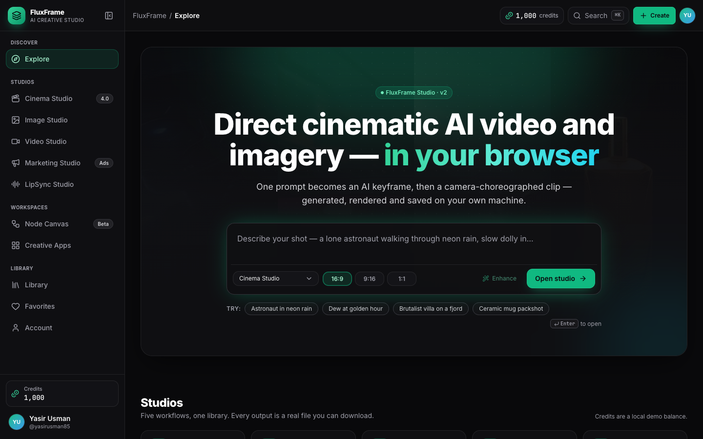

## What it is

FluxFrame is a Higgsfield-style creative studio built as a single-page app: you type a prompt (or drop an image), pick an engine, and get an image, a camera-choreographed video clip, a talking portrait or a multi-scene ad that you can download as a real file. Every generation runs through one job system with credits, progress, cancel, retry and reload recovery, and everything you make lands in a local library that survives refreshes. It is a portfolio project, so it is deliberately transparent about what is real AI and what is simulated — the table below is the contract.

## What's real vs. simulated

| Area | Status | How it actually works |
| --- | --- | --- |
| **Text-to-image** | **Real** | Calls the public, anonymous [Pollinations](https://pollinations.ai) image endpoint. It is rate-limited to roughly one request every 15 s, so the client serialises all requests, backs off on 403/429 and reports what it is waiting for. The endpoint currently serves a single model ("sana"); the six "engines" in the UI steer the *prompt* with style suffixes rather than switching server models. If the endpoint is unreachable the job falls back to a procedural render that is explicitly labelled "Procedural fallback". |
| **Video & Cinema studios** | **Real files, not a video model** | An AI keyframe (generated, or your upload) is animated by an in-browser camera engine: pan, tilt, zoom, dolly, orbit and roll with focal-length and aperture looks, drawn to a canvas at 30 fps and captured with `MediaRecorder` into a `.webm` you can download. This is deterministic camera choreography, **not** a diffusion video model — the provider badge says "Motion engine" for that reason. |
| **LipSync studio** | **Real, audio-driven** | Uploaded audio is decoded with the Web Audio API into a per-frame loudness envelope that drives jaw and head motion; the original audio is muxed into the output file. Script mode has no audio to capture (browser speech synthesis cannot be recorded), so it times syllables from the text and burns captions into the frames — the clip is silent and says so. |
| **Marketing studio** | **Real** | A product URL becomes a packshot (uploaded or AI-generated) rendered into a 9–11 s multi-scene ad with typography, tone palettes and per-scene camera moves. Output is a real video file. |
| **Node canvas** | **Real** | An executable graph. Prompt → Image → Motion nodes run through the same pipelines as the studios; every node output is a project in the library. |
| **Credits, plans, API keys** | **Simulated** | Local only (`localStorage`). They exist so the product flows — cost per engine, insufficient balance, top-up, refunds on failure — can be exercised end to end. Nothing is billed and generated keys are never sent anywhere. |
| **Storage & privacy** | **Local** | Blobs live in IndexedDB, metadata in `localStorage`. The only data that leaves the browser is the prompt text sent to Pollinations (plus Google Fonts). Uploads never leave your machine. |

## Feature tour

### Explore `/`

- Hero composer: type a prompt, choose a studio, submit — it deep-links into that studio with the prompt prefilled.
- Showcase gallery filterable by nine categories; every card carries the prompt, engine, ratio and camera preset that produced it, so **Remix** restores all of them.
- Recent-projects row and engine cards that explain what each engine actually does.

### Image Studio `/create/image`
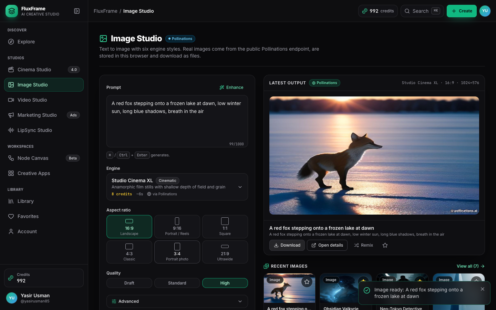
- Six engines (Flux Realism v2, Studio Cinema XL, Cyber Concept Pro, HyperDetail Ultra, Aurora Frame, Painterly Muse), six aspect ratios, three quality tiers, negative prompt and seed under **Advanced**.
- Deterministic **Enhance** (style-keyed, not random), live queue panel with the client's stage messages ("waiting 12s for the next slot"), provider badge on every output.
- Lightbox, real JPEG download, remix, and a recent row that links to the filtered library.
- Shortcuts: `⌘↵` / `Ctrl+Enter` generates from the prompt box.

### Video Studio `/create/video` & Cinema Studio `/create/cinema`
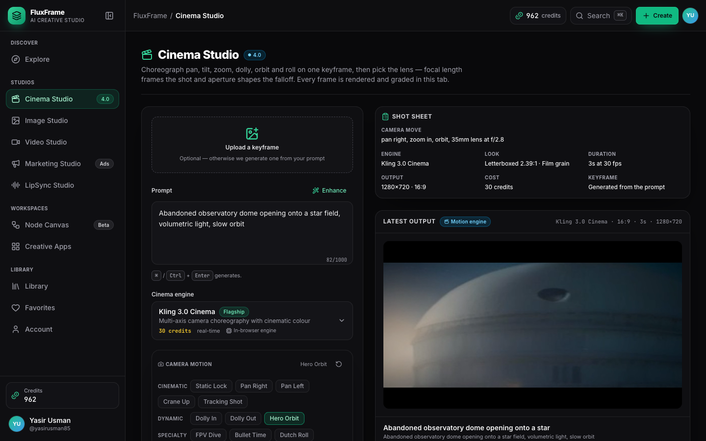
- Start from a prompt (keyframe is generated with the camera description appended) or drop your own keyframe (≤ 15 MB, normalised to 2048 px).
- Eleven camera presets (Dolly In, Hero Orbit, FPV Dive, Bullet Time, Crane Up…) plus six-axis sliders, focal length 18–135 mm and aperture f/1.4–f/16, with a **live preview loop** that uses the same drawing code as the renderer.
- 3 / 5 / 10 s at 30 fps, ratio-aware 720p-class output, engine "looks" (grain, vignette, 2.39:1 letterbox, light leaks, tint, handheld) and a speed-ramped action engine.
- A real `.webm` in a custom player (scrub, loop, mute, fullscreen, download).

### LipSync Studio `/create/lipsync`
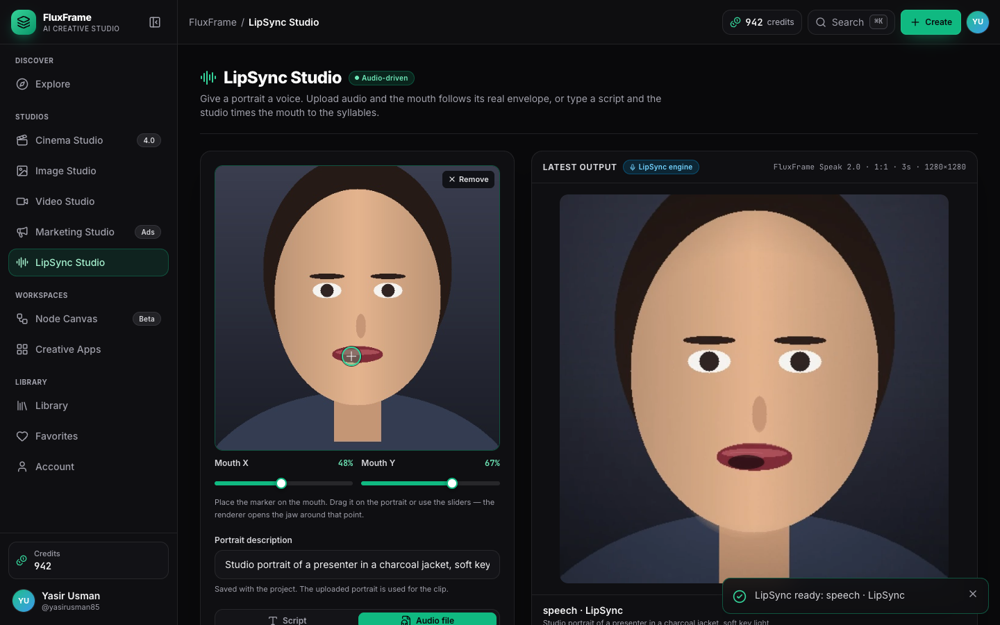
- Portrait upload or generated portrait; **Audio** mode accepts MP3/WAV/M4A/OGG (≤ 25 MB, first 60 s) and **Script** mode types dialogue with optional burned-in captions and a browser-TTS "Speak preview".
- Mouth calibration sliders (X/Y) place the jaw pivot on your portrait — there is no face detection, so the UI asks instead of guessing.
- Expression and amplitude controls; audio is muxed into the output when you upload a file.

### Marketing Studio `/create/marketing`
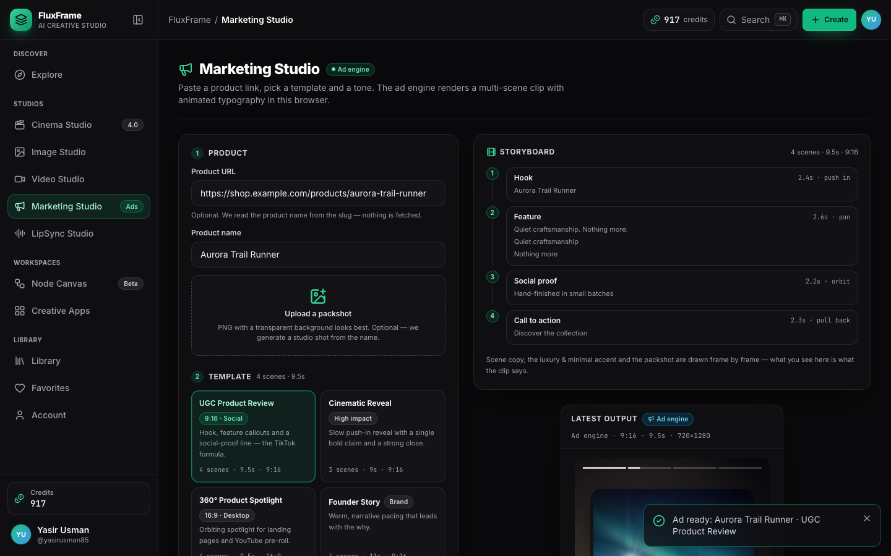
- Paste a product URL and the product name is parsed from the slug; four templates (UGC Product Review, Cinematic Reveal, 360° Product Spotlight, Founder Story), four brand tones that draft editable headline / sub-headline / proof / CTA copy, three formats (9:16, 16:9, 1:1).
- Packshot upload or AI-generated product shot; fixed 25-credit cost.

### Node Canvas `/canvas`
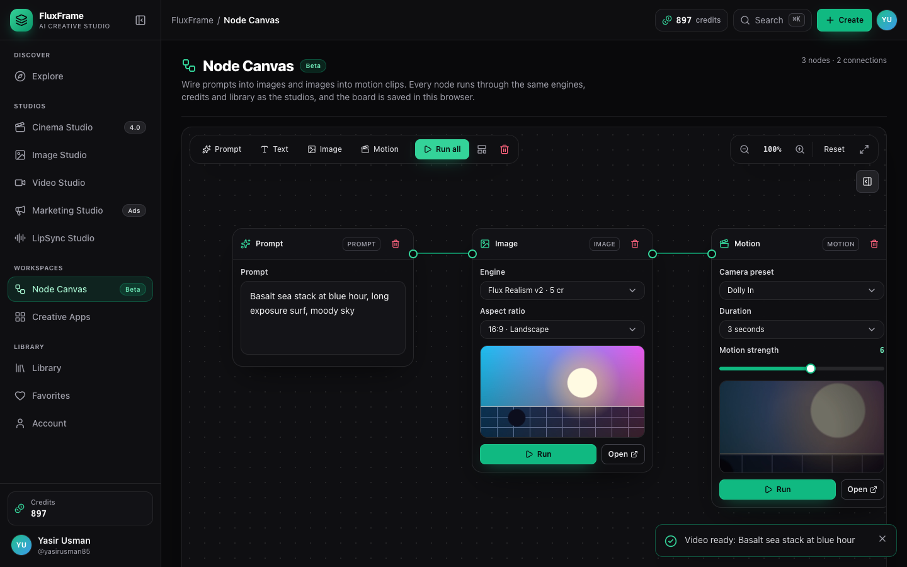
- Prompt, Image, Motion and Text nodes with typed ports; run a single node or **Run all** to resolve the graph in dependency order.
- Pan, zoom, fit; the graph persists locally so you can reload and continue. Outputs are library projects tagged with origin "canvas".

### Creative Apps `/apps`
- Five form-driven apps on top of the same pipelines: Style Snap, Outfit Vending Machine, LogoMotion (logo + 5 s orbit reveal video), Shots Storyboarder (four generations composited into a labelled 2×2 contact sheet) and Character Sheet.

### Library `/projects` & project detail `/projects/:id`
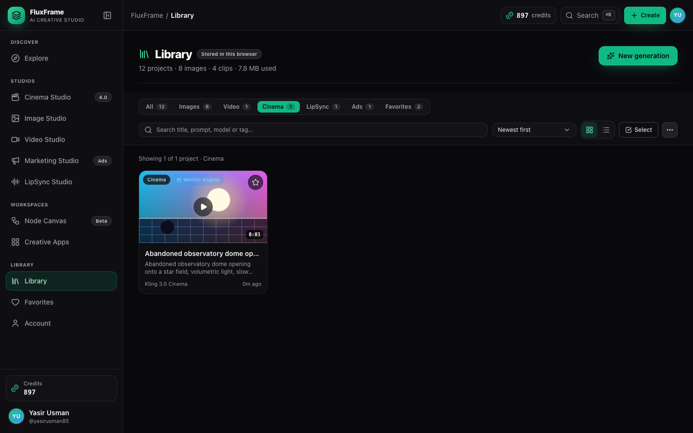
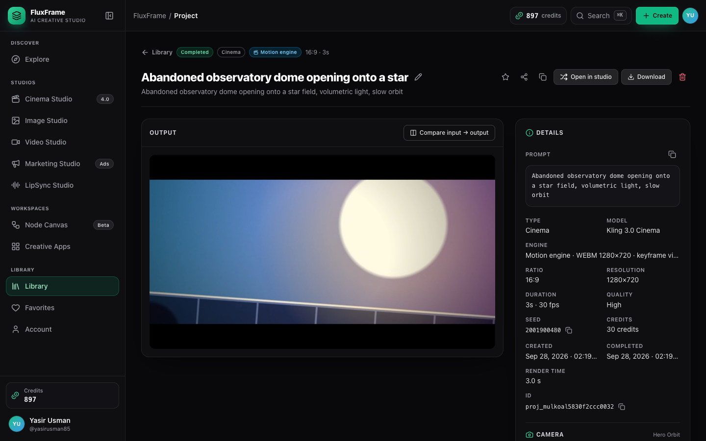
- Search, type filters (All / Image / Video / Cinema / LipSync / Marketing / Favorites), sort, grid or list view, multi-select bulk delete, favourites, status overlays for in-progress and failed jobs.
- Detail page: rename, full settings, provider and render time, download, share link, duplicate, remix, delete. Deleting a project garbage-collects its blobs.

### Account `/account`
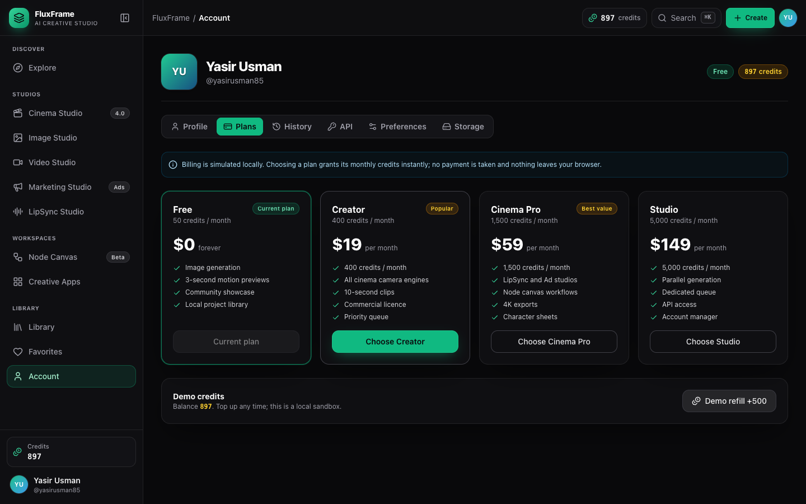
- Profile, plans (simulated), full credit history (every spend / refund / grant linked to its project), API keys (generated locally, masked, revocable — simulated), preferences, and a **Storage** tab with the real IndexedDB footprint and an orphan-blob cleanup.

### Command palette & keyboard
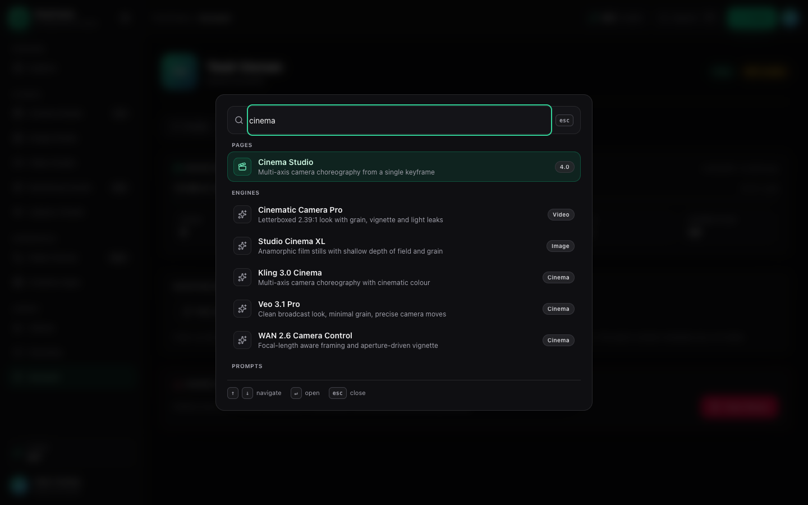
- `⌘K` / `Ctrl+K` opens a palette over pages, studios, showcase presets and recent projects; `Esc` closes any dialog; arrow keys drive sliders and the before/after compare.
- Header shows active jobs (with a dropdown), the credits pill (opens top-up) and a global **Create** button.

### Mobile
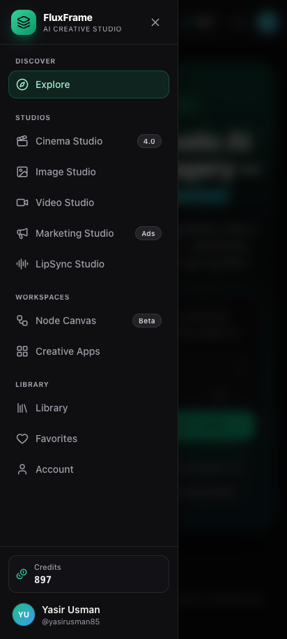
- Off-canvas navigation below 768 px, stacked studio layouts, touch-sized controls. The E2E suite includes a Pixel 7 project.

## Engineering highlights

- **Generation runner independent of pages** (`src/lib/generation-runner.ts`). A page calls `generate()` and can navigate away; the runner keeps an `AbortController` per job, streams progress and stage text into the project store, turns errors into friendly messages, **refunds credits when a pipeline fails**, supports cancel and retry (retry re-charges a refunded job), caps each studio at three concurrent jobs, and on reload marks interrupted jobs as failed with a "retry" path via the store's rehydrate hook.
- **Rate-limit-aware Pollinations client** (`src/lib/pollinations.ts`). One promise chain serialises every request so concurrent jobs share the anonymous quota; a 403/429 sets a shared 15 s back-off that all callers respect; up to three attempts with progressive delays; 60 s timeout; abort propagates as a proper `AbortError`; status callbacks feed the queue panel. Pipelines fall back to a labelled procedural render only for provider errors, never for user cancels.
- **Pipelines behind one contract** (`src/lib/pipelines/`). `image`, `motion`, `lipsync` and `ad` are lazy-loaded modules implementing `Pipeline(ctx) → PipelineOutput`, so a real diffusion backend could replace a renderer without touching a page. Creative Apps pass custom multi-step pipelines through the same runner.
- **IndexedDB asset store with object-URL cache and GC** (`src/lib/asset-store.ts`). Generated and uploaded blobs are stored by id (`idb-keyval`), resolved to cached object URLs, released when a project is deleted, and swept by an orphan collector; an in-memory fallback keeps the app working when IndexedDB is unavailable. Downloads are real files, and `localStorage` only holds small metadata.
- **MediaRecorder renderer with a duration fix** (`src/lib/render/canvas-recorder.ts`). Frames are driven by wall-clock time so a 3 s clip is 3 s regardless of draw cost; `setTimeout` (not rAF) keeps rendering in background tabs and headless browsers; the best supported codec is negotiated (VP9/Opus → VP8 → MP4); and because Chrome's WebM output lacks duration metadata, the blob is patched with `fix-webm-duration` so scrubbing and the time display work.
- **Deep-linkable studios.** Every studio parses the same query parameters (`prompt`, `model`, `ratio`, `duration`, `camera`, `product`, `template`, `tone`, `script`, `source`, `remix`), which is what powers Explore remix, the command palette, library remix and the node canvas.
- **Code-splitting.** Routes are lazy with a Suspense skeleton; Vite manual chunks separate React, Framer Motion and icons; the video engines are only downloaded when a video studio is used.
- **Design tokens.** One Tailwind v4 theme (`src/styles/globals.css`): emerald brand scale, zinc surfaces, Inter / JetBrains Mono, shared motion keyframes, glass and glow utilities — studios differ by icon and copy, not by palette.
- **Accessibility.** Focus management in modals and the palette, labelled icon buttons, ARIA roles on tabs / segmented controls / switches / sliders, a global focus ring, reduced-motion respect, and an axe check on every page in E2E (no critical/serious violations).
- **Testing pyramid.** Vitest + Testing Library (happy-dom) for the libraries, stores and components; Playwright for the product with a mocked Pollinations route (fast, offline, deterministic), a rate-limit retry scenario, real video assertions (a playable `<video>` with the requested duration), a mobile project and axe — all run in CI.
- **Deploy anywhere static.** `VITE_BASE` selects the base path (`/fluxframe/` on GitHub Pages), the router derives its `basename` from it, a SPA `404.html` fallback covers deep links on Pages, and `public/_redirects` does the same on Cloudflare Pages.

## Architecture

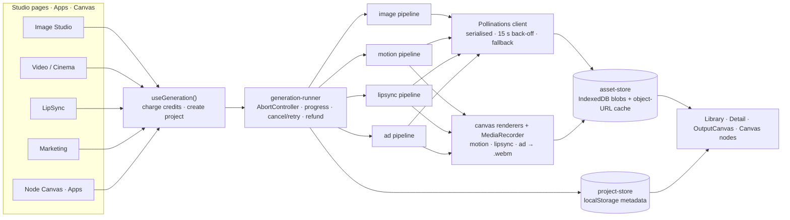

The full write-up — module map, data model, lifecycle sequence diagram, the rendering engines, persistence keys, error handling and the testing strategy — is in [`docs/ARCHITECTURE.md`](docs/ARCHITECTURE.md).

## Getting started

Requires **Node 20+** (CI uses Node 20).

```bash
npm ci                          # install (lockfile-exact)
npm run dev                     # http://localhost:5173
npx playwright install chromium # once, before running the E2E suite
```

### Scripts

| Script | What it does |
| --- | --- |
| `npm run dev` | Vite dev server with HMR |
| `npm run build` | Type-check (`tsc -b`) and build to `dist/` |
| `npm run preview` | Serve the production build |
| `npm run typecheck` | `tsc --noEmit` over the app and the E2E suite |
| `npm run lint` | ESLint (no `any`, `import type` enforced, hooks rules) |
| `npm run test` | Vitest unit tests |
| `npm run e2e` | Playwright: `chromium` (desktop) + `mobile` (Pixel 7) projects |
| `npm run e2e:ui` | Playwright UI mode |
| `npm run demo:record` | Runs the demo tour with video on → `demo/walkthrough.webm` |
| `npm run demo:screenshots` | Runs the tour and refreshes `docs/screenshots/*.png` |

### Environment

| Variable | Used by | Meaning |
| --- | --- | --- |
| `VITE_BASE` | build | Base path for the deployed app. Default `/`; the Pages workflow sets `/fluxframe/`. |
| `CI` | Playwright | Uses `vite preview` of a production build instead of the dev server, 2 retries. |
| `DEMO=1` | Playwright | Enables the `demo` project (1440×900, video on) that runs `e2e/demo/*.spec.ts`. |
| `SCREENSHOTS=1` | demo tour | Also writes the README screenshots. |
| `DEMO_LIVE=1` | demo tour | Uses the real Pollinations endpoint instead of the mock (slower: ~15 s between requests). |

### Browser support

- **Chrome / Edge / Firefox (current)**: everything, including video rendering (WebM, VP9 or VP8).
- **Safari 16.4+**: images everywhere; video rendering depends on Safari's `MediaRecorder` support for canvas capture and produces `.mp4` where available. If recording is unsupported the studios say so instead of failing silently.
- Private windows without IndexedDB fall back to in-memory assets for the session.

## Known limitations

- The public image endpoint is anonymous and rate-limited (~1 request / 15 s). Batch jobs queue behind each other; a busy endpoint means waiting, and a 403 storm means the labelled procedural fallback.
- Video is camera choreography over a single keyframe. Subjects do not move independently; that needs a diffusion video backend (see roadmap).
- No face detection: LipSync asks you to place the mouth pivot with two sliders.
- Script-mode LipSync is silent — browser speech synthesis cannot be captured into a file. Upload audio for sound.
- Audio is capped at the first 60 s (25 MB) and uploads at 15 MB / 2048 px.
- Jobs cannot survive a page reload (the browser owns the work); they are marked failed with a one-click retry.

## Roadmap

- Real diffusion video backend behind the existing `Pipeline` contract, unlocked by a user-supplied API key.
- Face-landmark detection to auto-place the LipSync jaw and add eye blinks.
- WebCodecs encoder for faster-than-real-time rendering and MP4 everywhere.
- Optional cloud sync of the library (the asset store is already id-addressed).
- Batch generation and a shared queue view across studios.

## Project structure

```
src/
  app/            App, providers, lazy router (basename from VITE_BASE)
  components/
    ui/           design-system kit: Button, IconButton, Modal, Tabs, Slider, Dropzone, Toast…
    app-shell/    Layout, Sidebar, Header, CommandPalette, Lightbox, ErrorBoundary
    generation/   ModelSelector, RatioSelector, DurationSelector, CameraMotionControl, PromptEnhancer, QueuePanel, MotionPreview
    media/        VideoPlayer, MediaCard, OutputCanvas, ProviderBadge, ImageCompare
    canvas/       node canvas internals
  features/       one folder per route: explore, image-studio, video-studio, cinema-studio, lipsync-studio,
                  marketing-studio, canvas, apps, account, projects, not-found
  hooks/          useGeneration, useAsset, useDocumentTitle, useMediaQuery
  lib/
    pollinations.ts        rate-limit-aware image client
    generation-runner.ts   job lifecycle (start / cancel / retry / refund)
    pipelines/             image · motion · lipsync · ad (lazy)
    render/                canvas-recorder, drawing, motion, lipsync, ad engines
    asset-store.ts         IndexedDB blobs + object-URL cache + GC
    catalog.ts             engines, camera presets, templates, apps, plans
    audio-utils.ts         decode, envelope, script timing, muxing
  store/          Zustand persist stores: project, credit, ui, account
  types/          domain model (GenerationProject, CameraMotionSettings, …)
tests/            Vitest unit tests
e2e/              Playwright specs, helpers, fixtures, demo tour
docs/             ARCHITECTURE.md, DEMO-SCRIPT.md, screenshots
.github/workflows CI (lint · typecheck · unit · build · e2e) and GitHub Pages deploy
```

## Demo video

The narrated walkthrough follows [`docs/DEMO-SCRIPT.md`](docs/DEMO-SCRIPT.md) — a timestamped script just under nine minutes long that explains *why* each part is built the way it is, not just what it does. The screen recording underneath it is produced by the Playwright demo tour (`npm run demo:record` → `demo/walkthrough.webm`, 1440×900, dark mode, clean storage), so the on-screen sequence is reproducible; the same tour with `SCREENSHOTS=1` generates every screenshot in this README.

## Process notes

FluxFrame was built with AI-assisted development. Automatic prompt/response capture was **not** configured before development began, so no transcript is presented as an automatically captured log — the honest disclosure, plus the exact verification commands and what CI runs, is in [`CAPTURE-TEST.md`](CAPTURE-TEST.md).

## Acknowledgements

Image generation courtesy of the public [Pollinations](https://pollinations.ai) endpoint. The product surface is inspired by [Higgsfield](https://higgsfield.ai); engine names mirror that catalogue for UI parity only — what actually runs is always shown in the provider badge.
